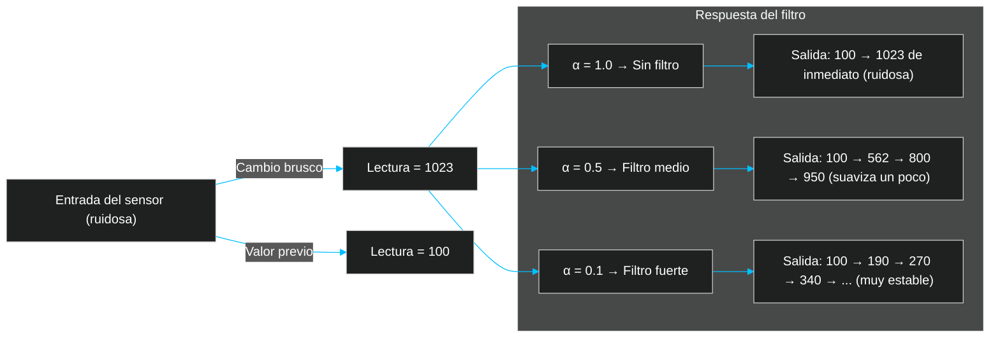

<style type="text/css">
    h1 {
        text-align: center;
        margin-bottom: 1rem;
    }
    article {
        align-content: center;
        justify-items: center;
    }
    section {
        display: flex;
        flex-direction: column;
        gap: 0.5rem;
    }
    p {
        max-width: 125ch;
    }
</style>
<article>
<h1>
Que hice?
</h1>
<section>
<p>
Probe el Modulo LCD 160x128, Y para esto hice una interfaz que me mostrara 
datos de un Sensor Efecto Hall Linear Encapsulado TO 92UA AH3503 LPN O.
</p>

<p>
Lo que necesitaba era ver en tiempo real los datos que me daba el sensor 
respecto a la cercanía de un Imán de Neodimio para poder comparar la efectividad
entre imanes.
</p>
<p>
Como también necesitaba probar funcionalidades incluí en la Interfaz el valor de brillo actual y la posibilidad de cambiar el brillo usando el Serial Monitor.
</p>
</section>
<h1>
Optimización
</h1>
<section>
<p>
En cuanto a la optimización, Lo principal es entender los distintos 
tipos de <strong>primitivos</strong>:
</p>

<br>

| Primitivo | Bytes | Rango Aproximado | Negativos |
| :---------: | :-----: | :---------: | :---------: |
| `int` | 2 bytes | -32,768 a 32,767 (16 bits en Arduino UNO) | Si |
| `unsigned int` | 2 bytes | 0 a 65,535 | No |
| `long (int32_t)` | 4 bytes | -2,147,483,648 a 2,147,483,647 | Si |
| `unsigned long (uint32_t)`| 4 bytes | 0 a 4,294,967,295 | No |
| `int8_t` | 1 byte | -128 a 127 | Si |
| `uint8_t` | 1 byte | 0 a 255 | No |
| `int16_t` | 2 bytes | -32,768 a 32,767 | Si |
| `uint16_t` | 2 bytes | 0 a 65,535 | No |
| `float` | 4 bytes | ≈ ±3.4×10³⁸ | Si |

<br>

<p>
También hay que tener en cuenta que los <code>float</code> siempre operan en 32 bits por lo que
es mas lento.

Una alternativa mas ligera a una variable <code>float</code> seria reemplazar el valor por un entero y luego usar <strong>aritmética entera escalada</strong> es decir, usar enteros que representen decimales multiplicados por un factor (<i>técnica de fixed point arithmetic</i>).
</p>
<p>
<strong>Ejemplo:</strong>

Si tengo <code>alpha = 0.05;</code>, se podia representar como <code>alpha_scaled = 5;</code> y considerar que vale <code>5 / 100</code>

Lo que cambiaría <code type='cpp'>filtrado = alpha * lectura + (1 - alpha) * filtrado</code> 

a

<code type='cpp'>filtrado = ( (alpha_scaled * lectura) + ((100 - alpha_scaled) * filtrado) / 100) </code>

Con esto todas las variables podrían ser <code>int16_t o uint16_t</code>

Lo que eliminaría cálculos en coma flotante y por ende se ahorraría <strong>RAM</strong> y <strong>ciclos de CPU</strong>
</p>

</section>
<section>
<h1>
Porque no se usa <code>analogWriteResolution()</code>?
</h1>
<p>
Esta función solo existe en microcontroladores avanzados como el Arduino Leonardo, Due o ESP32.

Sirve para definir la resolución de salida PWM o DAC, es decir, cuantos bits usa la función <code>analogWrite()</code>.

Por defecto, <code>analogWrite()</code> trabaja en 8 bits (0-255)

Pero usando <code>analogWriteResolution()</code> le defino al microcontrolador que acepte valores de 0 a 1023 para escribir PWM (10 bits)

Esto permite que la salida sea mas precisa y suave, util para generar señales mas finas.
</p>
</section>
</article>
<!-- Me aburrí de hacer HTML que pereza  -->

# Qué hace el filtro?

```cpp
filtrado = alpha * lectura + (1 - alpha) * filtrado;
```

Es un **filtro paso bajo exponencial** (*Exponencial Moving Average o EMA*).

Su función es **suavizar la señal de salida del sensor (lectura)** para eliminar/reducir el ruido eléctrico o magnético, sin hacer demasiado lenta la operación.

| Símbolo | Significado |
| :---: | :---: |
| `lectura` | Valor leído del sensor |
| `filtrado` | Valor anterior suavizado |
| `alpha` | Coeficiente entre `0` y `1` Que indica cuanto se confía en la lectura nueva. (Que no sea una lectura errónea por el ruido electromagnético en este caso) |

La formula seria:

$y[n] = a \cdot x[n] + (1 - a) \cdot y[n - 1]$

Donde:
- `x[n]` --> lectura actual del sensor.
- `y[n]` --> salida actual (filtrada).
- `y[n-1]` --> valor filtrado anterior.

[Info Sobre Formulas en MD AKA LaTex](https://en.wikibooks.org/wiki/LaTeX/Mathematics)

Por ende si Asignamos a alpha los siguientes Valores:

- `alpha = 1.0` --> **Sin Filtro**, responde instantáneamente, pero la salida es ruidosa. (La salida/Mapeo de la salida del sensor se vuelve ruidosa).
- `alpha = 0.5` --> **Filtro medio**, Es decir la lectura saldrá con la mitad de la lectura actual y la otra mitad con el valor filtrado anterior.
- `alpha = 0.1` --> **Totalmente Filtrado**, El valor de salida/Mapeado se vuelve mas estable, pero el tiempo de respuesta sera ligeramente mayor (Mas lento), Ya que debe hacer las operaciones.

> En este proyecto, se recomienda un valor entre **0.05** y **0.2** dependiendo de la sensibilidad del sensor Hall y el nivel de ruido.



> --- [Sebaxsus 2025](https://github.com/Sebaxsus/)